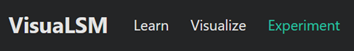
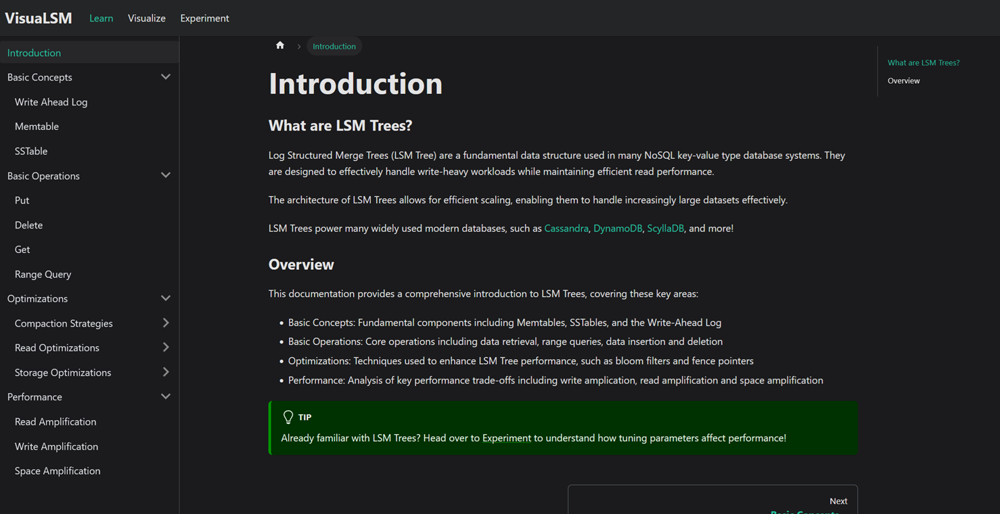
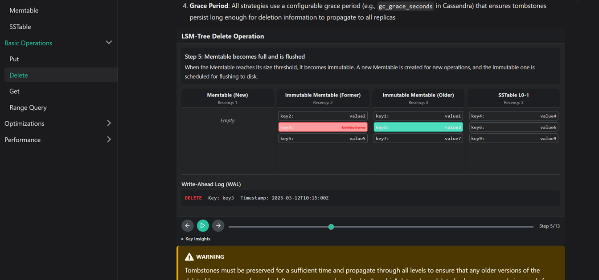
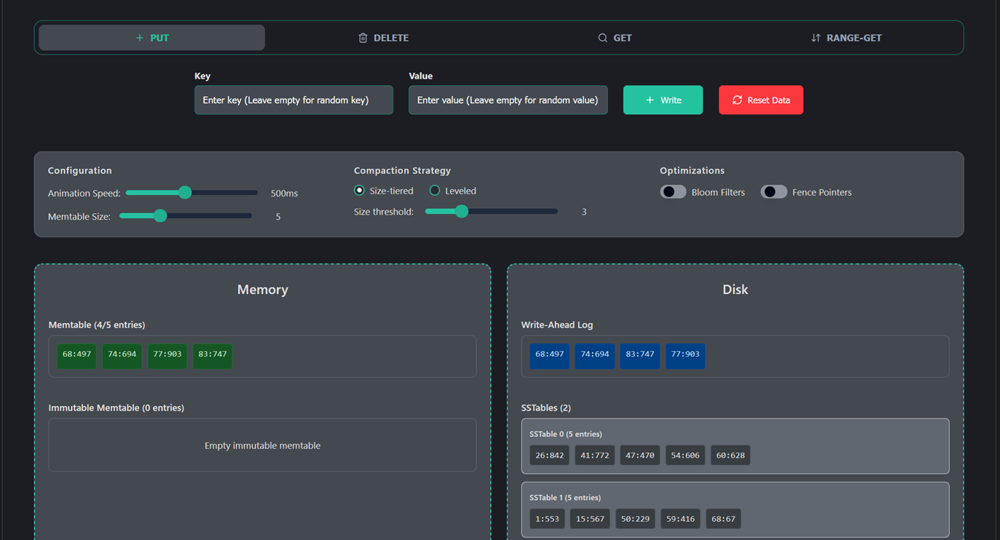
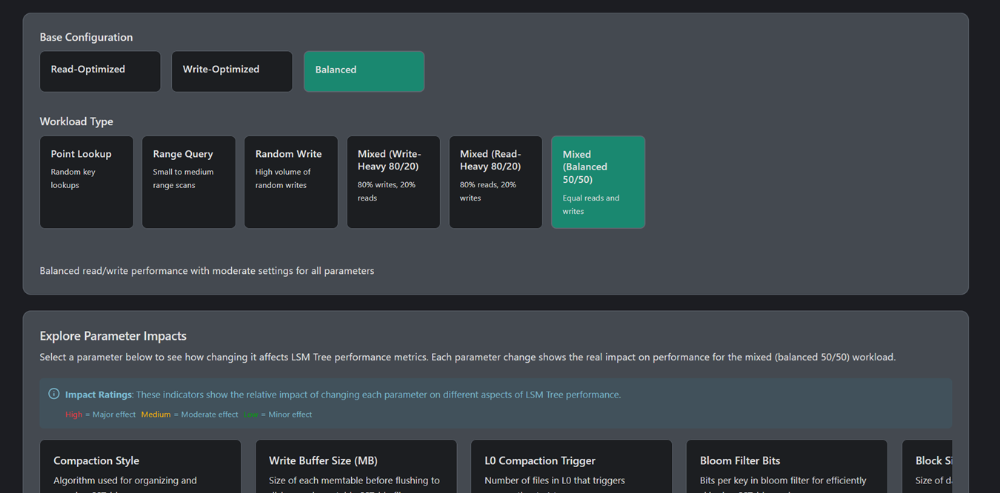
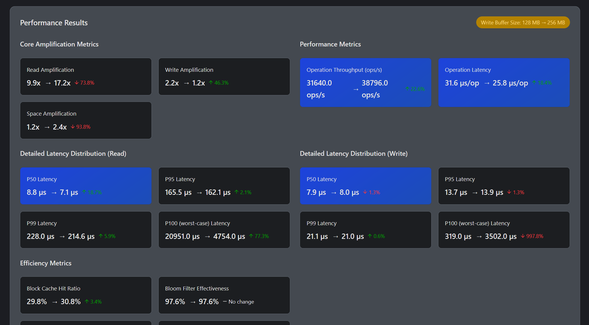
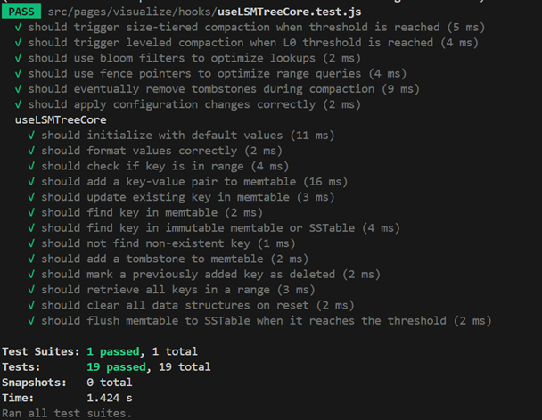

# VisuaLSM

<h1 align="center">VisuaLSM</h1>

<p align="center">
  
</p>

<p align="center">
  VisuaLSM is an interactive educational platform for exploring and learning about Log-Structured Merge (LSM) Trees - the foundation of many modern NoSQL databases like RocksDB, LevelDB, Cassandra, and more.
</p>

## Features

- **📚 Learn**: Comprehensive documentation covering LSM Tree concepts, operations, and optimizations
- **👁️ Visualize**: Interactive visualizations of core LSM Tree operations (Get, Put, Delete, Range queries)
- **🧪 Experiment**: Analyze how different parameters affect LSM Tree performance with real benchmark data
- **⚙️ Benchmark**: Includes a RocksDB benchmarking script to generate performance metrics

## Project Structure

- docs: Educational content about LSM Trees organized by topic
- src: React components for the interactive visualizations and UI
- static: Static assets, benchmark results (local dev testing build), and configuration data
- rocksdb-benchmark-script.sh: Script for running performance benchmarks with RocksDB

## Key Components

### **Learn** 
Documentation on key basic concepts on the LSM tree





### **Visualize** 
Demonstrates core operations with configurable parameters:
  - Compaction strategies (Size-tiered and Leveled)
  - Bloom filters for read optimization
  - Fence pointers for I/O reduction
  - Memtable size and compaction thresholds



### **Experiment** 
Explore with real benchmark test data on how different configurations affect:
  - Read amplification
  - Write amplification
  - Space amplification
  - Operation throughput
  - Latency metrics
  - Bloom filter effectiveness





## Running the RocksDB Benchmark
You can either test this on a local linux virtual machine or run it on an aws ec2 instance. You can refer to [RocksDB](https://github.com/facebook/rocksdb/wiki/performance-benchmarks) for their configuration to get an idea of which ec2 instance to use. 

### Prerequisites

1. Clone the RocksDB repository:
   ```bash
   git clone https://github.com/facebook/rocksdb.git
   cd rocksdb
   ```

2. Install necessary dependencies:
   ```bash
   # For Ubuntu/Debian
   sudo apt-get install libgflags-dev libsnappy-dev zlib1g-dev libbz2-dev liblz4-dev libzstd-dev
   
   ```

3. Build RocksDB:
   ```bash
   make static_lib
   ```

4. Copy the benchmark script from this repository to your RocksDB directory:
   ```bash
   cp /path/to/VisuaLSM/rocksdb-benchmark-script.sh /path/to/rocksdb/
   ```

### Running Benchmarks

The repository includes a benchmark script for generating performance data with RocksDB:

```bash
# Run all benchmarks
./rocksdb-benchmark-script.sh all

# Run a specific preset and workload
./rocksdb-benchmark-script.sh preset read-heavy point-lookup

# Run a baseline configuration
./rocksdb-benchmark-script.sh baseline balanced mixed-balanced

# Run a single parameter variation
./rocksdb-benchmark-script.sh variation balanced mixed-balanced block_size 32
```

You can either move the generated benchmark output files to `/static/data/benchmark_results` (which currently acts as the default fallback data when s3 fetch fails) or host it on a s3 bucket/database server for retrieval . Refer to `example.env` for a simple implementation of s3 retrieval.

## Local Development

This website is built using [Docusaurus](https://docusaurus.io/), a modern static website generator.

### Installation

```bash
$ yarn
```

### Local Development

```bash
$ yarn start
```

This command starts a local development server and opens up a browser window. Most changes are reflected live without having to restart the server.

### Build

```bash
$ yarn build
```

This command generates static content into the `build` directory and can be served using any static contents hosting service.

### Testing

The project includes comprehensive Jest unit tests to ensure proper functionality of the LSM Tree implementation. Tests cover:

- Core operations (Put, Get, Delete, Range queries)
- Memtable flushing
- Size-tiered and leveled compaction strategies
- Optimization features (Bloom filters, Fence pointers)
- Tombstone garbage collection
- Configuration changes

To run all tests:

```bash
$ yarn test
```

To run tests with coverage report:

```bash
$ yarn test --coverage
```

To run a specific test file:

```bash
$ yarn test useLSMTreeCore.test.js
```




### Deployment

Using SSH:

```bash
$ USE_SSH=true yarn deploy
```

Not using SSH:

```bash
$ GIT_USER=<Your GitHub username> yarn deploy
```

If you are using GitHub pages for hosting, this command is a convenient way to build the website and push to the `gh-pages` branch.

